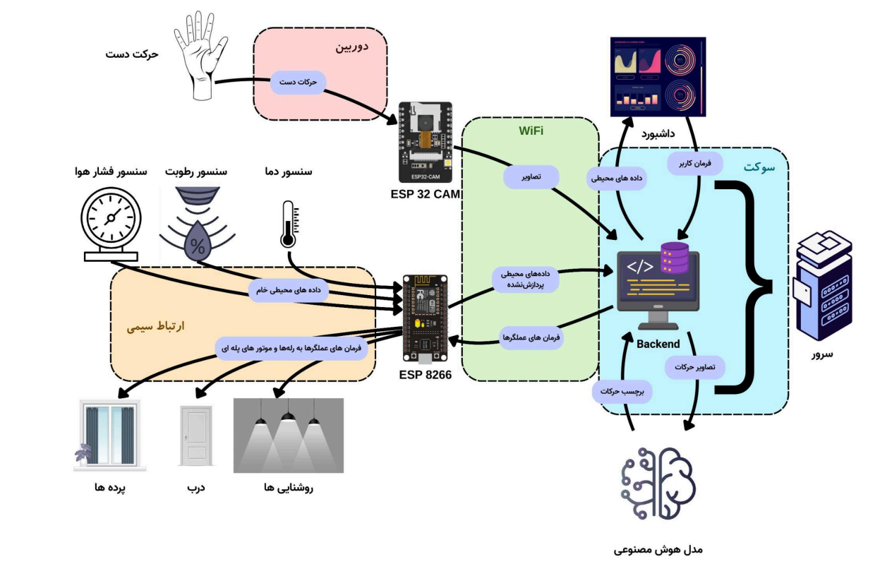
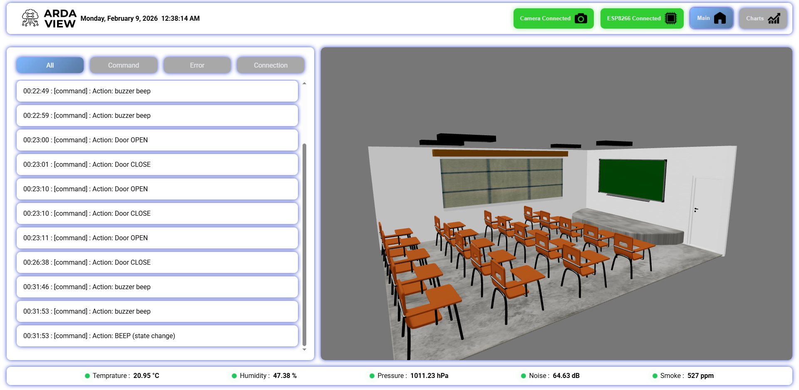
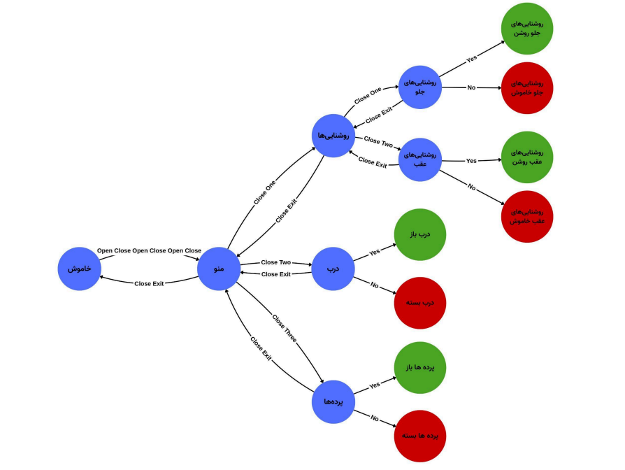
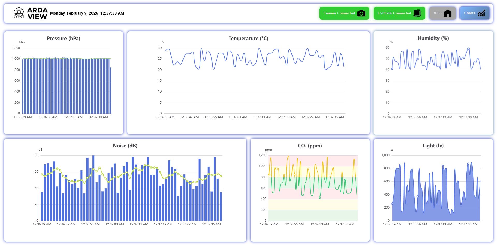
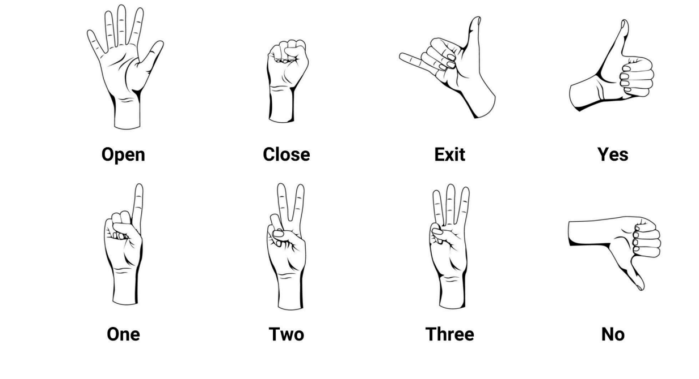

# Smart Class Project

A “smart classroom” system that combines:
- a **web server / UI** (JavaScript-heavy)
- an **AI / computer-vision module** (hand-gesture recognition)
- supporting **hardware** components
- project **manuals and reports** (PDFs)
- **screenshots** documenting the UI and system architecture

This README is written based on the documents in **`how-to/`** and the images in **`screenshots/`** (plus the AI-module README included in the repo).

---

## Table of Contents

- [Repository Structure](#repository-structure)
- [What’s Included (Manuals & Reports)](#whats-included-manuals--reports)
- [System Overview](#system-overview)
- [Screenshots](#screenshots)
- [Setup & Installation](#setup--installation)
- [Running the System](#running-the-system)
- [AI Module: Hand Gesture Recognition (MediaPipe)](#ai-module-hand-gesture-recognition-mediapipe)
- [Hardware](#hardware)
- [Troubleshooting](#troubleshooting)
- [License](#license)
- [Credits](#credits)

---

## Repository Structure

Top-level items found in the repository:

- `ai-model/` — AI / ML code and assets
- `hardware/` — hardware-related materials
- `how-to/` — manuals, setup instructions, and the main report (PDF)
- `screenshots/` — images used for documentation
- `web-server/` — web application / server code
- `README.md` — this documentation entry point
- `LICENSE`, `.gitignore`, `.gitattributes`

---

## What’s Included (Manuals & Reports)

The following manuals/reports are included under `how-to/`:

- `how-to/how-to-setup.pdf`  
  A setup-focused guide (installation / configuration steps and prerequisites).

- `how-to/manual.pdf`  
  The user/manual-style document (how to use the system, expected workflow, and operational notes).

- `how-to/mainReport.pdf`  
  The main project report (overall design, architecture, implementation details, and results).

You can browse them directly in GitHub here:
- https://github.com/amirsoleimani7/smart-class-project/tree/main/how-to

---

## System Overview

This project is organized around three main parts:

1. **Web Server / UI (`web-server/`)**
   - Provides the main interface for the “Smart Class” system.
   - Most of the repository is JavaScript, which strongly suggests the web server/UI is the largest component.

2. **AI / Gesture Recognition (`ai-model/`)**
   - Includes a complete hand-gesture-recognition project under:
     - `ai-model/hand-gesture-recognition-mediapipe/`
   - Uses **MediaPipe**, OpenCV, and TensorFlow to detect hands and classify:
     - hand signs (static)
     - finger gestures (movement/history-based)

3. **Hardware (`hardware/`)**
   - Contains the hardware aspect of the system (see the main report/manual for exact components, wiring, and deployment details).

A high-level system architecture diagram is provided in the screenshots section (see below).

---

## Screenshots

All screenshots are located in `screenshots/`:

- `screenshots/sys-arc.png` — System architecture diagram
- `screenshots/main-menu.png` — Main menu UI view
- `screenshots/menu.png` — Menu UI view
- `screenshots/charts.png` — Charts/analytics UI view
- `screenshots/signs.png` — Signs/gesture-related UI view

Direct links:
- https://github.com/amirsoleimani7/smart-class-project/tree/main/screenshots

### Preview

#### System Architecture


#### Main Menu


#### Menu


#### Charts / Analytics


#### Signs / Gestures


---

## Setup & Installation

The authoritative setup steps are in:

- `how-to/how-to-setup.pdf`
- `how-to/manual.pdf`

Start here:
1. Open **`how-to/how-to-setup.pdf`** and follow the environment prerequisites and installation steps.
2. Use **`how-to/manual.pdf`** for how to operate the system once installed.
3. Refer to **`how-to/mainReport.pdf`** for architecture, design decisions, and deeper implementation notes.

Quick navigation:
- https://github.com/amirsoleimani7/smart-class-project/blob/main/how-to/how-to-setup.pdf
- https://github.com/amirsoleimani7/smart-class-project/blob/main/how-to/manual.pdf
- https://github.com/amirsoleimani7/smart-class-project/blob/main/how-to/mainReport.pdf

> Note: Because the setup instructions are provided as PDFs in this repository, this README intentionally points you to them as the source of truth.

---

## Running the System

How you run the full system depends on:
- the **web server** entrypoints under `web-server/`
- whether the **AI module** is run as a separate process/service
- the **hardware** setup described in the manuals

Use the manuals in `how-to/` to follow the intended run workflow end-to-end.

---

## AI Module: Hand Gesture Recognition (MediaPipe)

This repository includes a hand-gesture recognition module (translated to English) located at:

- `ai-model/hand-gesture-recognition-mediapipe/`

It is based on MediaPipe hand tracking and includes:
- a sample inference app (`app.py`)
- training notebooks:
  - `keypoint_classification.ipynb` (hand sign recognition)
  - `point_history_classification.ipynb` (finger gesture recognition)
- pre-trained models and training data under `model/`

### Requirements (from the included AI-module README)

- `mediapipe 0.8.1`
- OpenCV `3.4.2` or later
- TensorFlow `2.3.0` or later  
  (tf-nightly 2.5.0.dev or later only when creating a TFLite for an LSTM model)
- scikit-learn (optional; for confusion matrix visualization)
- matplotlib (optional; for confusion matrix visualization)

### Running the demo (webcam)

From inside `ai-model/hand-gesture-recognition-mediapipe/`:

```bash
python app.py
```

Common runtime options include:
- `--device` camera device number (default 0)
- `--width` capture width (default 960)
- `--height` capture height (default 540)
- `--use_static_image_mode`
- `--min_detection_confidence` (default 0.5)
- `--min_tracking_confidence` (default 0.5)

### Training workflow (high-level)

The module supports collecting training data and retraining:
- **Hand sign recognition training**
  - Collect keypoint data
  - Train using `keypoint_classification.ipynb`
- **Finger gesture recognition training**
  - Collect point-history data
  - Train using `point_history_classification.ipynb`
  - Optional LSTM-based model is available (requires tf-nightly)

For full details, see:
- `ai-model/hand-gesture-recognition-mediapipe/README.md`

---

## Hardware

Hardware-related materials are stored under:

- `hardware/`

For the exact bill of materials, wiring, deployment steps, and integration notes, refer to:
- `how-to/manual.pdf`
- `how-to/mainReport.pdf`

---

## Troubleshooting

If you run into issues, the fastest path is:

1. Re-check the PDF setup guide:
   - `how-to/how-to-setup.pdf`

2. Confirm you are following the operating workflow described in:
   - `how-to/manual.pdf`

3. For AI module issues:
   - verify webcam device index (`--device`)
   - verify Python deps match the stated requirements (MediaPipe / OpenCV / TensorFlow)
   - consult the AI module README:
     - `ai-model/hand-gesture-recognition-mediapipe/README.md`

---

## License

See:
- `LICENSE`

Note: The embedded AI hand-gesture module indicates it is under an Apache v2 license in its own documentation; review both the repository `LICENSE` and the AI module’s license references to ensure compliance for your intended usage.

---

## Credits

- Project repository: `amirsoleimani7/smart-class-project`
- AI module includes a translated version of:
  - https://github.com/Kazuhito00/hand-gesture-recognition-using-mediapipe
  - Translation and improvements credited in that module’s README.

---
